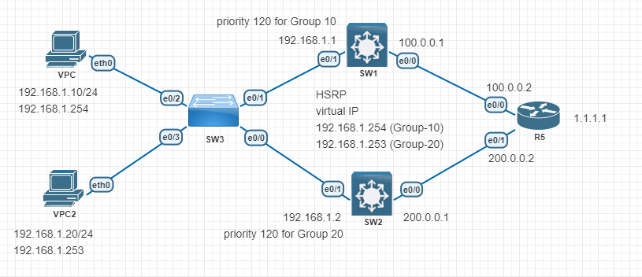

---
#### Lab for
- HSRP Load Sharing

#### Task
1. [Basic Configuration](#1-basic-configuration)
2. [Configure HSRP Load Sharing](#2-configure-hsrp-load-sharing)
---
#### 1. Basic Configuration
```
SW-1#
	int e0/0
	no switch
	ip add 100.0.0.1 255.255.255.0
	no shut

	int e0/1
	no swit
	ip add 192.168.1.1 255.255.255.0
	no shut
	
	ip routing
	ip route 0.0.0.0 0.0.0.0 100.0.0.2
```
```
SW-2#
	int e0/0
	no switch
	ip add 200.0.0.1 255.255.255.0
	no shut

	int e0/1
	no swit
	ip add 192.168.1.2 255.255.255.0
	no shut
	
	ip routing
	ip route 0.0.0.0 0.0.0.0 200.0.0.2
```
#### 2. Configure HSRP Load Sharing
```
SW-1#
	int e0/1
	standby 10 ip 192.168.1.254
	standby 10 priority 120
	standby 10 preempt

	standby 20 ip 192.168.1.253
```
```
SW-2#
	int e0/1
	standby 20 ip 192.168.1.253
	standby 20 priority 120
	standby 20 preempt

	standby 10 ip 192.168.1.254
```
#### 3. Verification
```
SW1# sh standby

Ethernet0/1 - Group 10
  State is Active
    2 state changes, last state change 00:01:34
  Virtual IP address is 192.168.1.254
  Active virtual MAC address is 0000.0c07.ac0a (MAC In Use)
    Local virtual MAC address is 0000.0c07.ac0a (v1 default)
  Hello time 3 sec, hold time 10 sec
    Next hello sent in 1.824 secs
  Preemption enabled
  Active router is local
  Standby router is 192.168.1.2, priority 100 (expires in 9.248 sec)
  Priority 120 (configured 120)
  Group name is "hsrp-Et0/1-10" (default)
Ethernet0/1 - Group 20
  State is Standby
    1 state change, last state change 00:01:25
  Virtual IP address is 192.168.1.253
  Active virtual MAC address is 0000.0c07.ac14 (MAC Not In Use)
    Local virtual MAC address is 0000.0c07.ac14 (v1 default)
  Hello time 3 sec, hold time 10 sec
    Next hello sent in 2.064 secs
  Preemption disabled
  Active router is 192.168.1.2, priority 120 (expires in 10.000 sec)
  Standby router is local
  Priority 100 (default 100)
  Group name is "hsrp-Et0/1-20" (default)
```
```
SW2# sh standby

Ethernet0/1 - Group 10
  State is Standby
    3 state changes, last state change 00:01:51
  Virtual IP address is 192.168.1.254
  Active virtual MAC address is 0000.0c07.ac0a (MAC Not In Use)
    Local virtual MAC address is 0000.0c07.ac0a (v1 default)
  Hello time 3 sec, hold time 10 sec
    Next hello sent in 1.744 secs
  Preemption disabled
  Active router is 192.168.1.1, priority 120 (expires in 9.776 sec)
  Standby router is local
  Priority 100 (default 100)
  Group name is "hsrp-Et0/1-10" (default)
Ethernet0/1 - Group 20
  State is Active
    2 state changes, last state change 00:02:26
  Virtual IP address is 192.168.1.253
  Active virtual MAC address is 0000.0c07.ac14 (MAC In Use)
    Local virtual MAC address is 0000.0c07.ac14 (v1 default)
  Hello time 3 sec, hold time 10 sec
    Next hello sent in 0.848 secs
  Preemption enabled
  Active router is local
  Standby router is 192.168.1.1, priority 100 (expires in 9.600 sec)
  Priority 120 (configured 120)
  Group name is "hsrp-Et0/1-20" (default)
```
```
VPC> trace 1.1.1.1
trace to 1.1.1.1, 8 hops max, press Ctrl+C to stop
 1   192.168.1.1   1.102 ms  1.742 ms  1.334 ms
 2   *100.0.0.2   3.015 ms (ICMP type:3, code:3, Destination port unreachable)  *
```
```
VPC2> trace 1.1.1.1
trace to 1.1.1.1, 8 hops max, press Ctrl+C to stop
 1   192.168.1.2   2.027 ms  2.026 ms  1.102 ms
 2   *200.0.0.2   1.578 ms (ICMP type:3, code:3, Destination port unreachable)  *
```