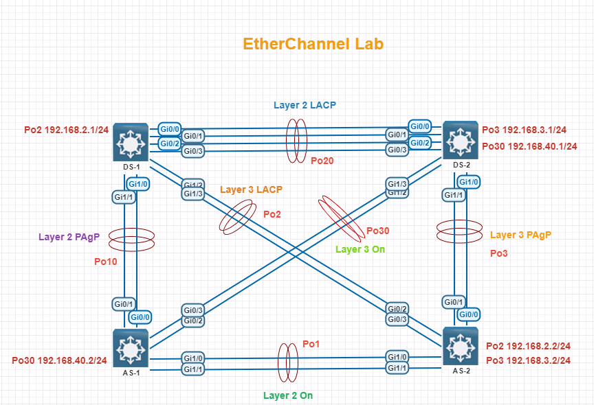

# Etherchannel (PAgP, LACP, Manual)

---
#### Lab for
- Etherchannel (PAgP, LACP, Manual)

#### Task
1. [LACP L2 config (DS-1 and DS-2)](#1-lacp-l2-config-ds-1-and-ds-2)
2. [LACP L3 config (DS-1 and AS-2)](#2-lacp-l3-config-ds-1-and-as-2)
3. [PAgP L2 config (DS-1 and AS-1)](#3-pagp-l2-config-ds-1-and-as-1)
4. [PAgP L3 config (DS-2 and AS-2)](#4-pagp-l3-config-ds-2-and-as-2)
5. [Etherchannel manual L2 mode config (AS-1 and AS-2)](#5-etherchannel-manual-l2-mode-config-as-1-and-as-2)
6. [Etherchannel manual L3 mode config (DS-2 and AS-1)](#6-etherchannel-manual-l3-mode-config-ds-2-and-as-1)
---

#### 1. LACP L2 config (DS-1 and DS-2)
```
DS-1#
	int range g0/0-3
	shut
	switchport trunk encap dot1q
	switchport mode trunk 
	channel-protocol lacp
	channel-group 20 mode active
	no shut
```
```
DS-2#
	int range g0/0-3
	shut
	switchport trunk encap dot1q
	switchport mode trunk 
	channel-protocol lacp
	channel-group 20 mode passive
	no shut
```
#### 2. LACP L3 config (DS-1 and AS-2)
```
DS-1#
	int port-channel 2
	no switchport
	ip add 192.168.2.1 255.255.255.0
	no shut

	int range g1/2-3
	shut
	no switchport
	channel-protocol lacp
	channel-group 2 mode active
	no shut
```
```
AS-2#
	int port-channel 2
	no switchport
	ip add 192.168.2.2 255.255.255.0
	no shut

	int range g0/2-3
	shut
	no switchport
	channel-protocol lacp
	channel-group 2 mode active
	no shut
```
#### LACP verification
```
  DS-1# sh etherchannel  summ
  
    Number of channel-groups in use: 2
    Number of aggregators:           2
    
    Group  Port-channel  Protocol    Ports
    ------+-------------+-----------+-----------------------------------------------
    2      Po2(RU)         LACP      Gi1/2(P)    Gi1/3(P)    
    20     Po20(SU)        LACP      Gi0/0(P)    Gi0/1(P)    Gi0/2(P)    
                                     Gi0/3(P)  
```


#### 3. PAgP L2 config (DS-1 and AS-1)
```
DS-1# 
	int range g1/0-1
	shut
	switchport trunk encapsulation dot1q
	switchport mode trunk
	channel-protocol pagp
	channel-group 10 mode desirable
	no shut
```
```
AS-1# 
	int range g0/0-1
	shut
	switchport trunk encapsulation dot1q
	switchport mode trunk
	channel-protocol pagp
	channel-group 10 mode auto
	no shut
```
#### 4. PAgP L3 config (DS-2 and AS-2)
```
AS-2# 
	int port-channel 3
	no switchport
	ip add 192.168.3.2 255.255.255.0
	no shut

	int range g0/0-1
	shut
	no switchport
	channel-protocol pagp
	channel-group 3 mode desirable
	no shut
```
```
DS-2# 
	int port-channel 3
	no switchport
	ip add 192.168.3.1 255.255.255.0
	no shut

	int range g1/0-1
	shut
	no switchport
	channel-protocol pagp
	channel-group 3 mode desirable
	no shut
```
#### PAgP Verification
```
  AS-2# sh etherch summ
  
    Number of channel-groups in use: 2
    Number of aggregators:           2
    
    Group  Port-channel  Protocol    Ports
    ------+-------------+-----------+-----------------------------------------------
    2      Po2(RU)         LACP      Gi0/2(P)    Gi0/3(P)    
    3      Po3(RU)         PAgP      Gi0/0(P)    Gi0/1(P)  
```
``` 
  AS-1# sh etherchannel summary 
  
    Number of channel-groups in use: 1
    Number of aggregators:           1
    
    Group  Port-channel  Protocol    Ports
    ------+-------------+-----------+-----------------------------------------------
    10     Po10(SU)        PAgP      Gi0/0(P)    Gi0/1(P) 
```
#### 5. Etherchannel manual L2 mode config (AS-1 and AS-2)
```
AS-1#
	int rang g1/0-1
	shut
	switchport trunk encapsulation dot1q
	switchport mode trunk
	channel-group 1 mode on
	no shut
```
```
AS-2#
	int range g1/0-1
	shut
	switchport trunk encapsulation dot1q
	switchport mode trunk
	channel-group 1 mode on
	no shut
```
#### 6. Etherchannel manual L3 mode config (DS-2 and AS-1)
```
AS-1#
	int port-channel 30
	no switchport
	ip add 192.168.40.2 255.255.255.0
	no shut

	int range g0/2-3
	shut
	no switchport
	channel-group 30 mode on
	no shut
```
```
DS-2#
	int port-channel 30
	no switchport
	ip add 192.168.40.1 255.255.255.0
	no shut

	int range g1/2-3
	shut
	no switchport
	channel-group 30 mode on
	no shut
```
#### Manual Mode verification
```
  AS-1# sh etherch summ
    Number of channel-groups in use: 2
    Number of aggregators:           2
    
    Group  Port-channel  Protocol    Ports
    ------+-------------+-----------+-----------------------------------------------
    1      Po1(SU)          -        Gi1/0(P)    Gi1/1(P)    
    10     Po10(SU)        PAgP      Gi0/0(P)    Gi0/1(P)  
```
```    
  DS-2# sh etherchannel summary 
    Number of channel-groups in use: 3
    Number of aggregators:           3
    
    Group  Port-channel  Protocol    Ports
    ------+-------------+-----------+-----------------------------------------------
    3      Po3(RU)         PAgP      Gi1/0(P)    Gi1/1(P)    
    20     Po20(SU)        LACP      Gi0/0(P)    Gi0/1(P)    Gi0/2(P)    
                                     Gi0/3(P)    
    30     Po30(RU)         -        Gi1/2(P)    Gi1/3(P) 
```

#### Trunk Verification
```
DS-1# sh int trunk

Port        Mode             Encapsulation  Status        Native vlan
Po10        on               802.1q         trunking      1
Po20        on               802.1q         trunking      1
```
```
DS-1# sh ip int bri   
                
Interface              IP-Address      OK? Method Status                Protocol   
Port-channel2          192.168.2.1     YES manual up   
```