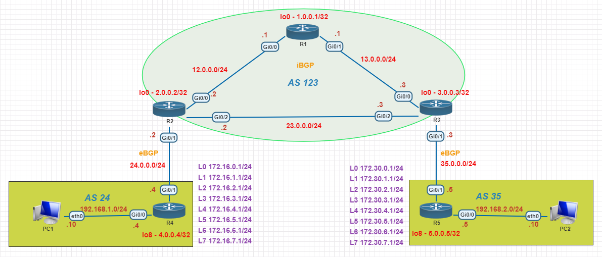

# BGP Lab

---

#### Lab for
- BGP Config
- Multihop
- Update source
- Next-hop self
- Attributes Config & Path Selection

#### Task
1. [Initial Config ](#1-initial-config)
2. [BGP Config](#2-bgp-config)
    - 2.1 neighboring by connected IP. (R1, R2, R3, R5)
    - 2.2 neighboring by loopback IP. (R2-R4) 
    - 2.3 advertise loopback networks by redistribute in R4.
    - 2.4 advertise loopback networks by network command in R5.
3. Verification <br>
    `# show ip bgp` <br>
    `# show ip bgp summary` <br>
    `# show ip bgp neighbors` <br>
    `# show ip bgp neighbors 12.0.0.2` <br>
    `# show tcp bri` <br>
    `# show ip route bgp` <br>
4. Multihop and update source config (R2 and R4)
5. Configure next-hop self (R2 and R3)
6. Verification
7. Attributes Config & Path Selection
---
#### 1. Initial Config
> R1, R2, R3, R4, R5
```py
R4#
     hostname R4
     
     int g0/0
     ip add 192.168.1.4 255.255.255.0
     no shut
     int g0/1
     ip add 24.0.0.4 255.255.255.0
     no shut
     int lo0
     ip add 172.16.0.1 255.255.255.0
     int lo1
     ip add 172.16.1.1 255.255.255.0
     int lo2
     ip add 172.16.2.1 255.255.255.0
     int lo3
     ip add 172.16.3.1 255.255.255.0
     int lo4
     ip add 172.16.4.1 255.255.255.0
     int lo5
     ip add 172.16.5.1 255.255.255.0
     int lo6
     ip add 172.16.6.1 255.255.255.0
     int lo7
     ip add 172.16.7.1 255.255.255.0
     int lo8
     ip add 4.0.0.4 255.255.255.0
```
#### 2. BGP Config
- 2.1 neighboring by connected IP. 
     > R1, R2, R3, R5
     ```py
     R3# 
     router bgp 123
     bgp router-id 3.0.0.3
     network 3.0.0.3 mask 255.255.255.255
     network 13.0.0.0 mask 255.255.255.0
     network 23.0.0.0 mask 255.255.255.0
     neighbor 35.0.0.5 remote-as 35
     neighbor 13.0.0.1 remote-as 123
     neighbor 23.0.0.2 remote-as 123
     ```
- 2.2 neighboring by loopback IP. 
     > R2-R4
     ```py
     "R4#"
     router bgp 24
     bgp router-id 4.0.0.4
     network 4.0.0.4 mask 255.255.255.255
     network 192.168.1.0 mask 255.255.255.0
     neighbor 2.0.0.2 remote-as 123
     ```
- 2.3 advertise loopback networks by redistribute in R4.
     ```py
     R4#
     router bgp 24
      redistribute connected
     ```
- 2.4 advertise loopback networks by network command in R5.
     ```py
     R5#
     router bgp 35
      network 172.30.0.0 mask 255.255.255.0
      network 172.30.1.0 mask 255.255.255.0
      network 172.30.2.0 mask 255.255.255.0
      network 172.30.3.0 mask 255.255.255.0
      network 172.30.4.0 mask 255.255.255.0
      network 172.30.5.0 mask 255.255.255.0
      network 172.30.6.0 mask 255.255.255.0
      network 172.30.7.0 mask 255.255.255.0
     ```
---

```py
R1#sh ip bgp
BGP table version is 4, local router ID is 1.0.0.1
Status codes: s suppressed, d damped, h history, * valid, > best, i - internal, 
              r RIB-failure, S Stale, m multipath, b backup-path, f RT-Filter, 
              x best-external, a additional-path, c RIB-compressed, 
Origin codes: i - IGP, e - EGP, ? - incomplete
RPKI validation codes: V valid, I invalid, N Not found

     Network          Next Hop            Metric LocPrf Weight Path
 *>  1.0.0.1/32       0.0.0.0                  0         32768 i
 *>i 2.0.0.2/32       12.0.0.2                 0    100      0 i
 *>i 3.0.0.3/32       13.0.0.3                 0    100      0 i
 * i 172.30.0.0/24    35.0.0.5                 0    100      0 35 i
 * i 172.30.1.0/24    35.0.0.5                 0    100      0 35 i
 * i 172.30.2.0/24    35.0.0.5                 0    100      0 35 i
 * i 172.30.3.0/24    35.0.0.5                 0    100      0 35 i
 * i 172.30.4.0/24    35.0.0.5                 0    100      0 35 i
 * i 172.30.5.0/24    35.0.0.5                 0    100      0 35 i
 * i 172.30.6.0/24    35.0.0.5                 0    100      0 35 i
 * i 172.30.7.0/24    35.0.0.5                 0    100      0 35 i
 * i 192.168.2.0      35.0.0.5                 0    100      0 35 i

```
```python
R2#sh ip bgp summ
BGP router identifier 2.0.0.2, local AS number 123
BGP table version is 4, main routing table version 4
12 network entries using 1728 bytes of memory
12 path entries using 960 bytes of memory
3/2 BGP path/bestpath attribute entries using 456 bytes of memory
1 BGP AS-PATH entries using 24 bytes of memory
0 BGP route-map cache entries using 0 bytes of memory
0 BGP filter-list cache entries using 0 bytes of memory
BGP using 3168 total bytes of memory
BGP activity 13/1 prefixes, 13/1 paths, scan interval 60 secs

 Neighbor        V           AS MsgRcvd MsgSent   TblVer  InQ OutQ Up/Down  State/PfxRcd
#4.0.0.4         4           24       0       0        1    0    0 never    Idle
 12.0.0.1        4          123      16      19        4    0    0 00:11:53        1
 23.0.0.3        4          123      27      27        4    0    0 00:20:04       10

```
```python
R2#sh tcp bri         
TCB       Local Address               Foreign Address             (state)
0CE19DE8  23.0.0.2.57725             23.0.0.3.179                ESTAB
0F0FE800  12.0.0.2.179               12.0.0.1.31685              ESTAB
```
```python
R5#sh ip route bgp
      1.0.0.0/32 is subnetted, 1 subnets
B        1.0.0.1 [20/0] via 35.0.0.3, 00:17:04
      2.0.0.0/32 is subnetted, 1 subnets
B        2.0.0.2 [20/0] via 35.0.0.3, 00:01:05
      3.0.0.0/32 is subnetted, 1 subnets
B        3.0.0.3 [20/0] via 35.0.0.3, 00:17:32
```
#### Before next-hop-self
```python
R1#sh ip bgp

     Network          Next Hop            Metric LocPrf Weight Path
 *>  1.0.0.1/32       0.0.0.0                  0         32768 i
 *>i 2.0.0.2/32       12.0.0.2                 0    100      0 i
 *>i 3.0.0.3/32       13.0.0.3                 0    100      0 i
 * i 4.0.0.0/24       4.0.0.4                  0    100      0 24 ?
 *>  12.0.0.0/24      0.0.0.0                  0         32768 i
 * i                  12.0.0.2                 0    100      0 i
 *>  13.0.0.0/24      0.0.0.0                  0         32768 i
 * i                  13.0.0.3                 0    100      0 i
 *>i 23.0.0.0/24      12.0.0.2                 0    100      0 i
 * i                  13.0.0.3                 0    100      0 i
 * i 24.0.0.0/24      4.0.0.4                  0    100      0 24 ?
"
 * i 172.16.0.0/24    4.0.0.4                  0    100      0 24 ?
 * i 172.16.1.0/24    4.0.0.4                  0    100      0 24 ?
 * i 172.16.2.0/24    4.0.0.4                  0    100      0 24 ?
 * i 172.16.3.0/24    4.0.0.4                  0    100      0 24 ?
 * i 172.16.4.0/24    4.0.0.4                  0    100      0 24 ?
 * i 172.16.5.0/24    4.0.0.4                  0    100      0 24 ?
 * i 172.16.6.0/24    4.0.0.4                  0    100      0 24 ?
 * i 172.16.7.0/24    4.0.0.4                  0    100      0 24 ?
 * i 172.30.0.0/24    35.0.0.5                 0    100      0 35 i
 * i 172.30.1.0/24    35.0.0.5                 0    100      0 35 i
 * i 172.30.2.0/24    35.0.0.5                 0    100      0 35 i
 * i 172.30.3.0/24    35.0.0.5                 0    100      0 35 i
 * i 172.30.4.0/24    35.0.0.5                 0    100      0 35 i
 * i 172.30.5.0/24    35.0.0.5                 0    100      0 35 i
 * i 172.30.6.0/24    35.0.0.5                 0    100      0 35 i
 * i 172.30.7.0/24    35.0.0.5                 0    100      0 35 i
 * i 192.168.1.0      4.0.0.4                  0    100      0 24 i
 * i 192.168.2.0      35.0.0.5                 0    100      0 35 i
"
```
#### After next-hop-self
```python
R1#sh ip bgp
     Network          Next Hop            Metric LocPrf Weight Path
 *>  1.0.0.1/32       0.0.0.0                  0         32768 i
 *>i 2.0.0.2/32       12.0.0.2                 0    100      0 i
 *>i 3.0.0.3/32       13.0.0.3                 0    100      0 i
 *>i 4.0.0.0/24       12.0.0.2                 0    100      0 24 ?
 *>  12.0.0.0/24      0.0.0.0                  0         32768 i
 * i                  12.0.0.2                 0    100      0 i
 *>  13.0.0.0/24      0.0.0.0                  0         32768 i
 * i                  13.0.0.3                 0    100      0 i
 *>i 23.0.0.0/24      12.0.0.2                 0    100      0 i
 * i                  13.0.0.3                 0    100      0 i
 *>i 24.0.0.0/24      12.0.0.2                 0    100      0 24 ?
"
 *>i 172.16.0.0/24    12.0.0.2                 0    100      0 24 ?
 *>i 172.16.1.0/24    12.0.0.2                 0    100      0 24 ?
 *>i 172.16.2.0/24    12.0.0.2                 0    100      0 24 ?
 *>i 172.16.3.0/24    12.0.0.2                 0    100      0 24 ?
 *>i 172.16.4.0/24    12.0.0.2                 0    100      0 24 ?
 *>i 172.16.5.0/24    12.0.0.2                 0    100      0 24 ?
 *>i 172.16.6.0/24    12.0.0.2                 0    100      0 24 ?
 *>i 172.16.7.0/24    12.0.0.2                 0    100      0 24 ?
 *>i 172.30.0.0/24    13.0.0.3                 0    100      0 35 i
 *>i 172.30.1.0/24    13.0.0.3                 0    100      0 35 i
 *>i 172.30.2.0/24    13.0.0.3                 0    100      0 35 i
 *>i 172.30.3.0/24    13.0.0.3                 0    100      0 35 i
 *>i 172.30.4.0/24    13.0.0.3                 0    100      0 35 i
 *>i 172.30.5.0/24    13.0.0.3                 0    100      0 35 i
 *>i 172.30.6.0/24    13.0.0.3                 0    100      0 35 i
 *>i 172.30.7.0/24    13.0.0.3                 0    100      0 35 i
 *>i 192.168.1.0      12.0.0.2                 0    100      0 24 i
 *>i 192.168.2.0      13.0.0.3                 0    100      0 35 i
"
```
#### Attribute (Path Selection)
```python
"default attribute"
R1#sh ip bgp               
     Network          Next Hop            Metric LocPrf Weight Path
"*>i 23.0.0.0/24      12.0.0.2                 0    100      0 i"
 * i                  13.0.0.3                 0    100      0 i
```
```python
"Router-ID attribute"
R3#
router bgp 123
 bgp router-id 2.0.0.1
----------------------------------------------
R1#sh ip bgp               
     Network          Next Hop            Metric LocPrf Weight Path
"*>i 23.0.0.0/24      13.0.0.3                 0    100      0 i"
 * i                  12.0.0.2                 0    100      0 i
```
```python
"Metric attribute"
R1#
access-list 1 permit 23.0.0.0 0.0.0.255
route-map metric 10
 match ip add 1
 set metric 10
route-map metric 20

router bgp 123
neighbor 13.0.0.3 route-map metric in
----------------------------------------------
R1#sh ip bgp          
     Network          Next Hop            Metric LocPrf Weight Path
 * i 23.0.0.0/24      13.0.0.3                10    100      0 i
"*>i                  12.0.0.2                 0    100      0 i"
```
```python
"Origin Code attribute"
R2#
router bgp 123
 no network 23.0.0.0 mask 255.255.255.0
 redistribute connected
----------------------------------------------
R1#sh ip bgp          
     Network          Next Hop            Metric LocPrf Weight Path
 * i 23.0.0.0/24      12.0.0.2                 0    100      0 ?
"*>i                  13.0.0.3                10    100      0 i"
```
```python
"Local Preference attribute"
R1#
access-list 1 permit 23.0.0.0 0.0.0.255
route-map local-pref 10
 match ip add 1
 set local-preference 200
route-map local-pref 20

router bgp 123
 neighbor 12.0.0.2 route-map local-pref in
----------------------------------------------
R1#sh ip bgp          
     Network          Next Hop            Metric LocPrf Weight Path
"*>i 23.0.0.0/24      12.0.0.2                 0    200      0 ?"
 * i                  13.0.0.3                10    100      0 i
```
```python
"Weight attribute"
R1#
route-map weight permit 10
 match ip address 1
 set weight 100
route-map weight permit 20

router bgp 123
 neighbor 12.0.0.2 route-map local-pref in
----------------------------------------------
R1#sh ip bgp          
     Network          Next Hop            Metric LocPrf Weight Path
"*>i 23.0.0.0/24      13.0.0.3                 0    100    100 i"
 * i                  12.0.0.2                 0    200      0 ?
```