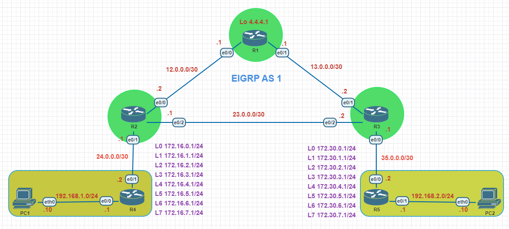

# EIGRP Lab

---
#### Lab for
- EIGRP 
- named EIGRP
- EIGRP summarization
- EIGRP Unequal Cost Load Balancing

#### Task
1. [Basic config (Assign IP address)](#1-basic-config-assign-ip-address)
2. [Configure eigrp with AS number 1 (R1 to R5)](#2-configure-eigrp-with-as-number-1-r1-to-r5)
3. [Configure R2-R4 as static neighbor](#3-configure-r2-r4-as-static-neighbor)
4. [Configure R5 as EIGRP named mode config](#4-configure-r5-as-eigrp-named-mode-config)
5. [Configure passive interface in R4 and R5](#5-configure-passive-interface-in-r4-and-r5)
6. [Configure summarization in R4 and R5](#6-configure-summarization-in-r4-and-r5)
7. [Unequal loadbalancing](#7-unequal-loadbalancing)
---
#### 1. Basic config (Assign IP address)
> _example: R1_
```
R1#
	int e0/0
	ip add 12.0.0.1 255.255.255.252
	no shut
	int e0/1
	ip add 13.0.0.1 255.255.255.252
	no shut
	int lo0
	ip add 4.4.4.1 255.255.255.255
```
#### 2. Configure eigrp with AS number 1 (R1 to R5)
> _example: R1_ 
```
R1#
	router eigrp 1
	 network 4.4.4.1 0.0.0.0
	 network 12.0.0.0 0.0.0.3
	 network 13.0.0.0 0.0.0.3
	 no auto
```
#### 3. Configure R2-R4 as static neighbor
```
R2#
	router eigrp 1
	 neighbor 24.0.0.2 Ethernet0/1
```
```
R4#
	router eigrp 1
	 neighbor 24.0.0.1 Ethernet0/1
```
#### 4. Configure R5 as EIGRP named mode config
```
R5#
	router eigrp MyLab
	 address-family ipv4 unicast autonomous-system 1
	  topology base
		no auto-summary
	  exit-af-topology
	  network 0.0.0.0
	 exit-address-family
```
#### 5. Configure passive interface in R4 and R5
```
R4#
	router eigrp 1
	 passive-interface default
	 no passive-interface Ethernet0/1
```
```
R5# 
	router eigrp MyLab
	  af-interface Ethernet0/1
	   passive-interface
```
#### 6. Configure summarization in R4 and R5	
```
R4#
	int e0/1
	ip summary-address eigrp 1 172.16.0.0/21
```
```
R5#
	router eigrp MyLab
		address-family ipv4 unicast autonomous-system 1
		af-interface e0/0
		summary-address 172.30.0.0/21
```
#### 7. Unequal loadbalancing
- 7.1 change bandwidth of e0/0 in R1 and R2 to 5000 kbit/s
	
	```
	R1# 
		int e0/0
		bandwidth 5000
	```
	```
	R2# 
		int e0/0
		bandwidth 5000
	```
- 7.2 configure unequal loadbalancing in R2 to reach 13.0.0.0 subnet.
	
	```
	R2#
		router eigrp 1
		variance 2
	```


#### Show commands
> `# show ip protocols` <br>
> `# show ip eigrp neighbors` <br>
> `# show ip route eigrp` <br>
> `# show ip eigrp topology` <br>
> `# show ip eigrp interface` <br>
> `# show ip eigrp topology all-links` <br>
> `# show ip eigrp traffic` <br>
