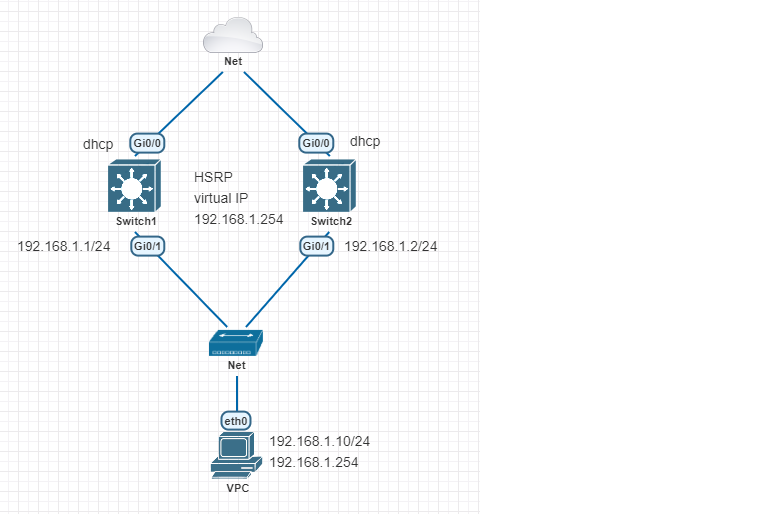

# Overall Lab




---
**Switch1**
| Interface | IP/Prefix |
| :--- | :---|
| g0/1 | 192.168.1.1/24 |
| g0/0 | dhcp |

**Switch2**
| Interface | IP/Prefix | 
| :--- | :---| 
| g0/1 | 192.168.1.2/24 |
| g0/0 | dhcp |

**VPC**
| Interface | IP/Prefix | Gateway|
| :--- | :---| :---|
| eth0 | 192.168.1.10/24 | 192.168.1.254

---
#### Lab for
- HSRP

#### Task

1. [Basic Configuration](#1-basic-configuration)
2. [Configure HSRP on both switches](#2-configure-hsrp-on-both-switches)
3. [Verification](#3-verification)
---

#### 1. Basic Configuration

```
Switch1# 
    host Switch1

    int g0/0
      no switchport
      ip add dhcp

    int g0/1
      no switchport
      ip add 192.168.1.1 255.255.255.0

    ip routing
```

```
Switch2# 
    host Switch2

    int g0/0
      no switchport
      ip add dhcp

    int g0/1
      no switchport
      ip add 192.168.1.2 255.255.255.0

    ip routing
```

#### 2. Configure HSRP on both switches
```
Switch1# 
    int g0/1
      standby 10 ip 192.168.1.254
      standby 10 preempt
      standby 10 priority 120
      standby 10 authentication md5 key-string MyLab.90
```

```
Switch2# 
    int g0/1
      standby 10 ip 192.168.1.254
      standby 10 preempt
      standby 10 authentication md5 key-string MyLab.90
```
#### 3. Verification

```shell
Switch1#show standby
GigabitEthernet0/1 - Group 10
  State is Active
    8 state changes, last state change 00:11:49
  Virtual IP address is 192.168.1.254
  Active virtual MAC address is 0000.0c07.ac0a (MAC In Use)
    Local virtual MAC address is 0000.0c07.ac0a (v1 default)
  Hello time 3 sec, hold time 10 sec
    Next hello sent in 0.512 secs
  Authentication MD5, key-string
  Preemption enabled
  Active router is local
  Standby router is 192.168.1.2, priority 100 (expires in 11.360 sec)
  Priority 120 (configured 120)
  Group name is "Group10" (cfgd)
  ```


```shell
Switch2#show standby
GigabitEthernet0/1 - Group 10
  State is Standby
    21 state changes, last state change 00:03:10
  Virtual IP address is 192.168.1.254
  Active virtual MAC address is 0000.0c07.ac0a (MAC Not In Use)
    Local virtual MAC address is 0000.0c07.ac0a (v1 default)
  Hello time 3 sec, hold time 10 sec
    Next hello sent in 1.904 secs
  Authentication MD5, key-string
  Preemption enabled
  Active router is 192.168.1.1, priority 120 (expires in 9.392 sec)
  Standby router is local
  Priority 100 (default 100)
  Group name is "hsrp-Gi0/1-10" (default)
```


