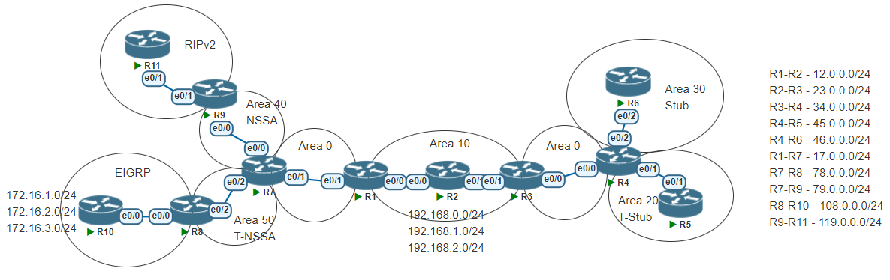

# OSPF Lab


---
|Subnets | |
| --- | --- |
| R1-R2  | 12.0.0.0/24 |
| R2-R3  | 23.0.0.0/24 |
| R3-R4  | 34.0.0.0/24 |
| R4-R5  | 45.0.0.0/24 |
| R4-R6  | 46.0.0.0/24 |
| R1-R7  | 17.0.0.0/24 |
| R7-R8  | 78.0.0.0/24 |
| R7-R9  | 79.0.0.0/24 |
| R8-R10 | 108.0.0.0/24 |
| R9-R11 | 119.0.0.0/24 |

| IP Address |    |
| ---------- | -- |
| R1         | 1  |
| R2         | 2  |
| R3         | 3  |
| R4         | 4  |
| R5         | 5  |
| R6         | 6  |
| R7         | 7  |
| R8         | 8  |
| R9         | 9  |
| R10        | 10 |
| R11        | 11 |
---
#### Lab for
- OSPF
- Virtual link
- Redistribute
- Create special area
- OSPF summarization

#### Task
1. [Assign IP address in all routers](#1-assign-ip-address-in-all-routers)
2. [Configure OSPF in R1 to R9](#2-configure-ospf-in-r1-to-r9)
3. [Create virtual links between R1 and R3](#3-create-virtual-links-between-r1-and-r3)
4. [Configure RIPv2 in R11 and R9](#4-configure-ripv2-in-r11-and-r9)
5. [Configure EIGRP in R8 and R10](#5-configure-eigrp-in-r8-and-r10)
6. [Configure redistribute in R8 and R9](#6-configure-redistribute-in-r8-and-r9)
7. [Configure area 30 as stub area](#7-configure-area-30-as-stub-area)
8. [Configure area 20 as totally stub area](#8-configure-area-20-as-totally-stub-area)
9. [Configure area 40 as nssa area](#9-configure-area-40-as-nssa-area)
10. [Configure area 50 as totally nssa area](#10-configure-area-50-as-totally-nssa-area)
11. [Configure OSPF summarization on R1, R3, R8](#11-configure-ospf-summarization-on-r1-r3-r8)


---
#### 1. Assign IP address in all routers
>_example: R2_
```shell
int e0/0
ip add 12.0.0.2 255.255.255.0
no shut
int e0/1
ip add 23.0.0.2 255.255.255.0
no shut
int lo0
ip add 192.168.0.1 255.255.255.0
int lo1
ip add 192.168.1.1 255.255.255.0
int lo2
ip add 192.168.2.1 255.255.255.0
```
    
#### 2. Configure OSPF in R1 to R9
> _example: R2_
```
router ospf 1
router-id 0.0.0.2
network 12.0.0.0 0.0.0.255 area 10
network 23.0.0.0 0.0.0.255 area 10
network 192.168.0.0 0.0.3.255 area 10
```
- 2.1. Verify

    ```
    R7#sh ip route ospf
    O IA     12.0.0.0 [110/20] via 17.0.0.1, 00:31:12, Ethernet0/1
    O IA     23.0.0.0 [110/30] via 17.0.0.1, 00:31:12, Ethernet0/1
    O IA     192.168.0.1 [110/21] via 17.0.0.1, 00:31:12, Ethernet0/1
    O IA     192.168.1.1 [110/21] via 17.0.0.1, 00:31:12, Ethernet0/1
    O IA     192.168.2.1 [110/21] via 17.0.0.1, 00:31:12, Ethernet0/1
    ```

#### 3. Create virtual links between R1 and R3
```
R1#
    router ospf 1
    area 10 virtual-link 0.0.0.3
```
```
R3#
    router ospf 1
    area 10 virtual-link 0.0.0.1
```
- 3.1. Verify

    ```
    R1#sh ip ospf virtual-links 
    Virtual Link OSPF_VL0 to router 0.0.0.3 is up
    Run as demand circuit
    DoNotAge LSA allowed.
    Transit area 10, via interface Ethernet0/0
    Topology-MTID    Cost    Disabled     Shutdown      Topology Name
            0           20        no          no            Base
    Transmit Delay is 1 sec, State POINT_TO_POINT,
    Timer intervals configured, Hello 10, Dead 40, Wait 40, Retransmit 5
        Hello due in 00:00:08
        Adjacency State FULL (Hello suppressed)
        Index 1/1/2, retransmission queue length 0, number of retransmission 1
        First 0x0(0)/0x0(0)/0x0(0) Next 0x0(0)/0x0(0)/0x0(0)
        Last retransmission scan length is 1, maximum is 1
        Last retransmission scan time is 0 msec, maximum is 0 msec
    ```

#### 4. Configure RIPv2 in R11 and R9
```
R9#
    router rip
    version 2
    no auto-summary
    network 119.0.0.0
```

#### 5. Configure EIGRP in R8 and R10
```
R8#
    router eigrp 108
    no auto-summary
    network 108.0.0.0 0.0.0.255
```
```
R10#
    router eigrp 108
    no auto
    network 108.0.0.0 0.0.0.255
    network 172.16.0.0 0.0.3.255
```

#### 6. Configure redistribute in R8 and R9
```
R8#
    router eigrp 108
    redistribute ospf 1 metric 10000 10 255 10 1500
    router ospf 1
    redistribute eigrp 108 subnets metric-type 2
```
```
R9#
    router rip
    redistribute ospf 1 metric 10
    router ospf 1
    redistribute rip metric 10 subnets
```
#### 7. Configure area 30 as stub area
```
R4#
    router ospf 1
    area 30 stub
```
```
R6#
    router ospf 1
    area 30 stub
```
- 7.1. Verify (no type 5 LSA, no ASBR)

    ```
    R6#sh ip ospf | sec Area
        Area 30
            Number of interfaces in this area is 1
            It is a stub area
            Area has no authentication
            Area ranges are
    ```

#### 8. Configure area 20 as totally stub area
```
R5#
    router ospf 1
    area 20 stub
```
```
R4#
    router ospf 1
    area 20 stub no-summary
```
- 8.1 Verify (no type 5 LSA, no ASBR, no type 3 summary LSA)

    ```
    R4#sh ip ospf | sec Area
        Area BACKBONE(0)
            Number of interfaces in this area is 1
        Area has no authentication
        Area ranges are
        Area 20
            Number of interfaces in this area is 1
            It is a stub area, no summary LSA in this area
            Generates stub default route with cost 1
        Area has no authentication
        Area ranges are
        Area 30
            Number of interfaces in this area is 1
            It is a stub area
            Generates stub default route with cost 1
        Area has no authentication
        Area ranges are
    ```
    ```
    R5#sh ip ospf data

                OSPF Router with ID (0.0.0.5) (Process ID 1)

            Router Link States (Area 20)

    Link ID         ADV Router      Age         Seq#       Checksum Link count
    0.0.0.4         0.0.0.4         1218        0x80000004 0x0001BB 1
    0.0.0.5         0.0.0.5         1211        0x80000004 0x00FBBE 1

            Net Link States (Area 20)

    Link ID         ADV Router      Age         Seq#       Checksum
    45.0.0.5        0.0.0.5         1225        0x80000001 0x008C6F

            Summary Net Link States (Area 20)

    Link ID         ADV Router      Age         Seq#       Checksum
    0.0.0.0         0.0.0.4         1268        0x80000001 0x0099A0
    ```

#### 9. Configure area 40 as nssa area
```
R7#
    router ospf 1
    area 40 nssa
```
```
R9#
    router ospf 1
    area 40 nssa
```
- 9.1 Verify (no type 5 LSA, ASBR allowed)

    ```
    R9#sh ip ospf data
            Summary Net Link States (Area 40)

    Link ID         ADV Router      Age         Seq#       Checksum
    12.0.0.0        0.0.0.7         1235        0x80000003 0x002DE0
    17.0.0.0        0.0.0.7         1235        0x80000003 0x00878B
    23.0.0.0        0.0.0.7         1235        0x80000003 0x0002F6
    34.0.0.0        0.0.0.7         1235        0x80000003 0x00D60D
    45.0.0.0        0.0.0.7         1235        0x80000002 0x00AD22
    46.0.0.0        0.0.0.7         1235        0x80000003 0x009E2F
    78.0.0.0        0.0.0.7         1235        0x80000003 0x006B6A
    192.168.0.1     0.0.0.7         1235        0x80000003 0x001896
    192.168.1.1     0.0.0.7         1235        0x80000003 0x000DA0
    192.168.2.1     0.0.0.7         1235        0x80000003 0x0002AA

            Type-7 AS External Link States (Area 40)

    Link ID         ADV Router      Age         Seq#       Checksum Tag
    119.0.0.0       0.0.0.9         1220        0x80000001 0x008E39 0
    ```
#### 10. Configure area 50 as totally nssa area
```
R8#
    router ospf 1
    area 50 nssa
```
```
R7#
    router ospf 1
    area 50 nssa no-summary
```
- 10.1 Verify (no type 3 LSA, no type 5 LSA, ASBR allowed)

    ```
    R8#sh ip ospf data
            Summary Net Link States (Area 50)

    Link ID         ADV Router      Age         Seq#       Checksum
    0.0.0.0         0.0.0.7         59          0x80000001 0x000F20

            Type-7 AS External Link States (Area 50)

    Link ID         ADV Router      Age         Seq#       Checksum Tag
    108.0.0.0       0.0.0.8         985         0x80000001 0x006F5C 0
    172.16.1.0      0.0.0.8         985         0x80000001 0x00601A 0
    172.16.2.0      0.0.0.8         985         0x80000001 0x005524 0
    172.16.3.0      0.0.0.8         985         0x80000001 0x004A2E 0
    ```

#### 11. configure ospf summarization on R1, R3, R8
```
R1#
    router ospf 1
    area 10 range 192.168.0.0 255.255.252.0
```
```
R3#
    router ospf 1
    area 10 range 192.168.0.0 255.255.252.0
```
```
R8#
    router ospf 1
    summary-address 172.16.0.0 255.255.252.0
```
- 11.1 Verify

    ```
    R7#sh ip route | sec 192.168    
    O IA  192.168.0.0/22 [110/21] via 17.0.0.1, 00:01:14, Ethernet0/1

    R7#sh ip route | sec 172.16
        172.16.0.0/22 is subnetted, 1 subnets
    O N2     172.16.0.0 [110/20] via 78.0.0.8, 00:00:38, Ethernet0/2
    ```

