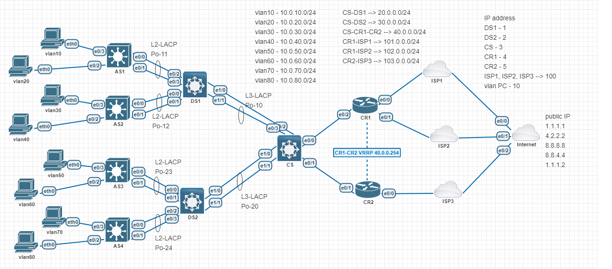

# Overall Lab




---

| VPC name | IP Address | Gateway | Vlan |
| :--- | :--- | :--- | :--- |
| vlan10-pc | 10.0.10.10/24 | 10.0.10.1 | 10 |
| vlan20-pc | 10.0.20.10/24 | 10.0.20.1 | 20 |
| vlan30-pc | 10.0.30.10/24 | 10.0.30.1 | 30 |
| vlan40-pc | 10.0.40.10/24 | 10.0.40.1 | 40 |
| vlan50-pc | 10.0.50.10/24 | 10.0.50.2 | 50 |
| vlan60-pc | 10.0.60.10/24 | 10.0.60.2 | 60 |
| vlan70-pc | 10.0.70.10/24 | 10.0.70.2 | 70 |
| vlan80-pc | 10.0.80.10/24 | 10.0.80.2 | 80 |

| Network | Subnet |
| :--- | :--- |
| DS1-CS | 20.0.0.0/24 |
| DS2-CS | 30.0.0.0/24 |
| CS-CR1-CR2 | 40.0.0.0/24 |
| CR1-ISP1 | 101.0.0.0/24 |
| CR1-ISP2 | 102.0.0.0/24 |
| CR2-ISP3 | 103.0.0.0/24 |

| Devices | IP Address |
| :--- | :--- |
| DS1 | 1 |
| DS2 | 2 |
| CS | 3 |
| CR1 | 4 |
| CR2 | 5 |
| ISP1 | 100 |
| ISP2 | 100 |
| ISP3 | 100 |

##### Goal
- VLANs 10-40 will use ISP1, failing over to ISP2.
- VLANs 50-80 will use ISP2, failing over to ISP1.
- If both ISPs fail, all VLANs will use ISP3.

##### Task
1. [Create vlan in AS1, AS2, AS3, AS4, DS1, and DS2.](create-vlan-in-as1,-as2,-as3,-as4,-ds1,-and-ds2)
1. Configure L2 etherchannel between AS and DS as the diagram.
1. Configure L3 etherchannel between DS and CS as the diagram.


---

1. Create vlan in AS1, AS2, AS3, AS4, DS1, and DS2

> _example: AS1 and DS1_
```
AS1#
    vlan 10
    vlan 20
    exit
    int e0/2
    switchport access vlan 20
    int e0/3
    switchport access vlan 10
```
```
DS1#
    vlan 10
    vlan 20
    vlan 30
    vlan 40
    exit
```
2. Configure L2 etherchannel between AS and DS as the diagram.

    - AS1 to DS1
    - AS2 to DS1
    - AS3 to DS2
    - AS4 to DS2

> _example: AS1 to DS1_

<table>
<tr>
<td>AS1</td><td>DS1</td>
</tr>
<td>

```
int rang e0/0-1
shut
switchport trunk enc dot
switchport mode trunk
channel-protocol lacp
channel-group 11 mode active
no shut
```

</td>
<td>

```
int rang e0/2-3
shut
switchport trunk enc dot
switchport mode trunk
channel-protocol lacp
channel-group 11 mode active
no shut
```

</td>

</tr>
</table>

3. Configure L3 etherchannel between DS and CS as the diagram.

    - DS1 to CS
    - DS2 to CS

> _DS1 to CS_

<table>
<tr><td>DS1</td><td>CS</td></tr>
<tr>
<td>

```
int port-channel 10
no switchport
ip add 20.0.0.1 255.255.255.0

int rang e1/0-1
shut
no switchport
channel-protocol lacp
channel-group 10 mode active
no shut
```

</td>
<td>

```
int port-channel 10
no switchport
ip add 20.0.0.3 255.255.255.0

int range e0/2-3
shut
no switchport
channel-protocol lacp
channel-group 10 mode active
no shut
```

</td>
</tr>
</table>

4. Configure Vlan 100 on CS and IP assign on CR1 and CR2.
```
CS#
    vlan 100
    exit

    int vlan 100
    ip add 40.0.0.3 255.255.255.0
    no shut

    int range e0/0-1
    switchport access vlan 100
```
```
CR1#
    int e0/0
    ip add 101.0.0.4 255.255.255.0
    no shut
    int e0/1
    ip add 102.0.0.4 255.255.255.0
    no shut
    int e0/2
    ip add 40.0.0.4 255.255.255.0
    no shut
```
```
CR2#
    int e0/0
    ip add 103.0.0.5 255.255.255.0
    no shut
    int e0/1
    ip add 40.0.0.5 255.255.255.0
    no shut
```


5. Configure vlan routing and OSPF for all internal subnets communications.
    5.1 Inter-vlan routing on DS1 and DS2.
    ```
    DS1#
        ip routing

        int vlan 10
        ip add 10.0.10.1 255.255.255.0
        no shut
        int vlan 20
        ip add 10.0.20.1 255.255.255.0
        no shut
        int vlan 30
        ip add 10.0.30.1 255.255.255.0
        no shut
        int vlan 40
        ip add 10.0.40.1 255.255.255.0
        no shut
    ```
    ```
    DS2#
        ip routing

        int vlan 50
        ip add 10.0.50.2 255.255.255.0
        no shut
        int vlan 60
        ip add 10.0.60.2 255.255.255.0
        no shut
        int vlan 70
        ip add 10.0.70.2 255.255.255.0
        no shut
        int vlan 80
        ip add 10.0.80.2 255.255.255.0
        no shut
    ```
    5.2 Configure OSPF in DS1, DS2, CS, CR1 and CR2.
    ```
    DS1#
        router ospf 1
        router-id 0.0.0.1
        network 10.0.10.0 0.0.0.255 area 0
        network 10.0.20.0 0.0.0.255 area 0
        network 10.0.30.0 0.0.0.255 area 0
        network 10.0.40.0 0.0.0.255 area 0
        network 20.0.0.0 0.0.0.255 area 0
    ```
    ```
    DS2#
        router ospf 1
        router-id 0.0.0.2
        network 10.0.50.0 0.0.0.255 area 0
        network 10.0.60.0 0.0.0.255 area 0
        network 10.0.70.0 0.0.0.255 area 0
        network 10.0.80.0 0.0.0.255 area 0
        network 30.0.0.0 0.0.0.255 area 0
    ```
    ```
    CS#
        ip routing

        router ospf 1
        router-id 0.0.0.3
        network 20.0.0.0 0.0.0.255 area 0
        network 30.0.0.0 0.0.0.255 area 0
        network 40.0.0.0 0.0.0.255 area 0
    ```
    ```
    CR1#
        router ospf 1
        router-id 0.0.0.4
        network 40.0.0.0 0.0.0.255 area 0
    ```
    ```
    CR2#
        router ospf 1
        router-id 0.0.0.5
        network 40.0.0.0 0.0.0.255 area 0
    ```

6. Configure Track to check reachability to ISP1 and ISP2 in CR1.

```
CR1#
    ip route 1.1.1.1 255.255.255.255 101.0.0.100
    ip route 1.1.1.2 255.255.255.255 102.0.0.100

    ip sla 1
    icmp-echo 1.1.1.1 source-interface Ethernet0/0
    threshold 500
    timeout 1000
    frequency 2
    ip sla schedule 1 life forever start-time now
    ip sla 2
    icmp-echo 1.1.1.2 source-interface Ethernet0/1
    threshold 500
    timeout 1000
    frequency 2
    ip sla schedule 2 life forever start-time now

    track 1 ip sla 1 reachability
    delay down 2 up 2
    track 2 ip sla 2 reachability
    delay down 2 up 2
```

7. Create default route on CR1 and CR2.
```
CR1#
    ip route 0.0.0.0 0.0.0.0 101.0.0.100 track 1
    ip route 0.0.0.0 0.0.0.0 102.0.0.100 track 2 2
```
```
CR2#
    ip route 0.0.0.0 0.0.0.0 103.0.0.100
```
8. Configure NAT on CR1 and CR2.

```
CR1#
    ip access-list standard LANS
    permit 10.0.0.0 0.0.127.255

    route-map ISP2 permit 10
    match ip address LANS
    match interface Ethernet0/1
    route-map ISP1 permit 10
    match ip address LANS
    match interface Ethernet0/0

    ip nat inside source route-map ISP1 interface Ethernet0/0 overload
    ip nat inside source route-map ISP2 interface Ethernet0/1 overload

    interface Ethernet0/0
    ip nat outside

    interface Ethernet0/1
    ip nat outside

    interface Ethernet0/2
    ip nat inside
```
```
CR2#
    int e0/0
    ip nat out
    int e0/1
    ip nat in
    
    ip access-list standard LANS
    permit 10.0.0.0 0.0.127.255
    
    ip nat insid sour list LANS inter e0/0 overload
```
9. Configure NAT rule and PBR Vlan 10-40 to ISP1 and Vlan 50-80 to ISP2 in CR1.

```
CR1#
    ip access-list standard LANS-10-40
        permit 10.0.10.0 0.0.0.255
        permit 10.0.20.0 0.0.0.255
        permit 10.0.30.0 0.0.0.255
        permit 10.0.40.0 0.0.0.255
    ip access-list standard LANS-50-80
        permit 10.0.50.0 0.0.0.255
        permit 10.0.60.0 0.0.0.255
        permit 10.0.70.0 0.0.0.255
        permit 10.0.80.0 0.0.0.255

    route-map PBR-MAP permit 10
        match ip address LANS-10-40
        set ip next-hop verify-availability 101.0.0.100 1 track 1
        set ip next-hop 102.0.0.100
    route-map PBR-MAP permit 20
        match ip address LANS-50-80
        set ip next-hop verify-availability 102.0.0.100 1 track 2
        set ip next-hop 101.0.0.100

    interface Ethernet0/2
        ip policy route-map PBR-MAP
```

10. Configure VRRP on CR1 and CR2.
```
CR1#
    int e0/2
    vrrp 40 ip 40.0.0.254
    vrrp 40 priority 120
    vrrp 40 track 10 decrement 40

    track 10 list boolean or
    object 1
    object 2
```
```
CR2#
    int e0/1
    vrrp 40 ip 40.0.0.254
```

11. Configure default route and Add default route to OSPF in CS.

```
CS#
    ip route 0.0.0.0 0.0.0.0 40.0.0.254

    router ospf 1
    default-information originate
```


