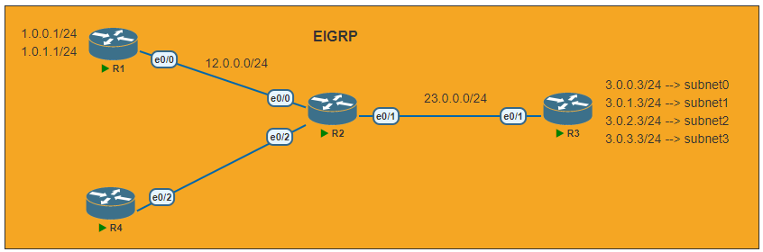

# Route Filtering

---
Lab for
- Access-List
- Distribution-List
- Prefix-List
- Route-Map

Task
1. [Initial Config](#1-initial-config)
2. [Configure EIGRP in all router](#2-configure-eigrp-in-all-router)
3. [Verification](#3-verification) <br>
    `# show ip route`
4. [Configure a distribution list on R2 to prevent R1 and R4 from accessing the 3.0.0.0/24 subnet.](#4-configure-a-distribution-list-on-r2-to-prevent-r1-and-r4-from-accessing-the-300024-subnet)
5. [Configure a prefix list on R2 to prevent R1 from accessing the 3.0.1.0/24 subnet.](#5-configure-a-prefix-list-on-r2-to-prevent-r1-from-accessing-the-301024-subnet)
6. [Configure a Route Map on R2 to prevent R4 from accessing the 3.0.2.0/24 subnet.](#6-configure-a-route-map-on-r2-to-prevent-r4-from-accessing-the-302024-subnet)
7. Commands <br>
  `# show access-list` <br>
  `# show ip prefix-list`  <br>
  `# show route-map`
---
#### 1. Initial Config
> R1, R2, R3, R4
```py
R2#
    host R2
    
    int e0/0
    ip add 12.0.0.2 255.255.255.0
    no shut
    int e0/1
    ip add 23.0.0.2 255.255.255.0
    no shut
    int e0/2
    ip add 24.0.0.2 255.255.255.0
    no shut
```
#### 2. Configure EIGRP in all router
```py
R2#
    router eigrp 123
    network 12.0.0.0 0.0.0.255
    network 23.0.0.0 0.0.0.255
    network 24.0.0.0 0.0.0.255
    no auto
```
#### 3. Verification
```py
R1#sh ip route | sec 3.0
      3.0.0.0/24 is subnetted, 4 subnets
D        3.0.0.0 [90/435200] via 12.0.0.2, 00:00:19, Ethernet0/0
D        3.0.1.0 [90/435200] via 12.0.0.2, 00:00:19, Ethernet0/0
D        3.0.2.0 [90/435200] via 12.0.0.2, 00:00:19, Ethernet0/0
D        3.0.3.0 [90/435200] via 12.0.0.2, 00:00:19, Ethernet0/0
```
#### 4. Configure a distribution list on R2 to prevent R1 and R4 from accessing the 3.0.0.0/24 subnet.
```py
R2#
    ip access-list standard subnet0
     deny   3.0.0.0 0.0.0.255 log
     permit any
     
    router eigrp 123
     distribute-list subnet0 out
```
```py
R1#sh ip route | sec 3.0
      3.0.0.0/24 is subnetted, 3 subnets
D        3.0.1.0 [90/435200] via 12.0.0.2, 00:06:15, Ethernet0/0
D        3.0.2.0 [90/435200] via 12.0.0.2, 00:06:15, Ethernet0/0
D        3.0.3.0 [90/435200] via 12.0.0.2, 00:06:15, Ethernet0/0
```
#### 5. Configure a prefix list on R2 to prevent R1 from accessing the 3.0.1.0/24 subnet.
```py
R2#
    ip prefix-list subnet1 deny 3.0.1.0/24
    ip prefix-list subnet1 permit 0.0.0.0/0 le 32
    
    router eigrp 123
     distribute-list prefix subnet1 out Ethernet0/0
```
```py
R1#sh ip route | sec 3.0
      3.0.0.0/24 is subnetted, 3 subnets
D        3.0.2.0 [90/435200] via 12.0.0.2, 00:06:15, Ethernet0/0
D        3.0.3.0 [90/435200] via 12.0.0.2, 00:06:15, Ethernet0/0
```
#### 6. Configure a Route Map on R2 to prevent R4 from accessing the 3.0.2.0/24 subnet.
```py
R2#
    ip access-list standard subnet2
     permit 3.0.2.0 0.0.0.255
    
    route-map map-for-subnet2 deny 10
     match ip address subnet2
    route-map map-for-subnet2 permit 20
    
    router eigrp 123
     distribute-list route-map map-for-subnet2 out Ethernet0/2
```
```py
R4#sh ip route | sec 3.0
      3.0.0.0/24 is subnetted, 2 subnets
D        3.0.1.0 [90/435200] via 24.0.0.2, 00:20:39, Ethernet0/2
D        3.0.3.0 [90/435200] via 24.0.0.2, 00:20:39, Ethernet0/2
```
