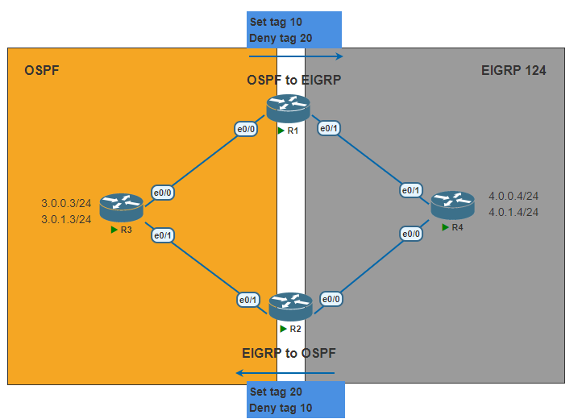

# Route Tag


---
Lab for
- Route tag
- Redistribution

Task
1. [Initial Config](#1-initial-config)
2. [Configure OSPF and EIGRP](#2-configure-ospf-and-eigrp)
3. [Create Route Map](#3-create-route-map-in-r1-and-r2)
4. [Configure Redistribution](#4-configure-redistribution-by-using-route-map)
5. Commands <br>
	`# sh route-map` <br>
	`# sh run | sec route-map` <br>
	`# sh ip route 3.0.0.3` <br>
	`# clear ip route *` <br>
	`# show ip ospf data` <br>
	`# show ip eigrp topo` <br>
---
#### 1. Initial Config
> R1, R2, R3, R4
```py
R1#
    hostname R1
    int e0/0
    ip add 13.0.0.1 255.255.255.0
    no shut
    int e0/1
    ip add 14.0.0.1 255.255.255.0
    no shut
```
#### 2. Configure OSPF and EIGRP
```py
R1#
    router ospf 1
    router-id 0.0.0.1
    network 13.0.0.0 0.0.0.255 area 0
    
    router eigrp 124
    network 14.0.0.0 0.0.0.255
no auto
```
```py
R2#
    router ospf 1
    router-id 0.0.0.2
    network 23.0.0.0 0.0.0.255 area 0
    
    router eigrp 124
    network 24.0.0.0 0.0.0.255
no auto
```
```py
R3#
    router ospf 1
    router-id 0.0.0.3
    network 13.0.0.0 0.0.0.255 area 0
    network 23.0.0.0 0.0.0.255 area 0
    network 3.0.0.0 0.0.0.255 area 0
    network 3.0.1.0 0.0.0.255 area 0
```
```py
R4#
    router eigrp 124
    network 14.0.0.0 0.0.0.255
    network 24.0.0.0 0.0.0.255
    network 4.0.0.0 0.0.0.255
    network 4.0.1.0 0.0.0.255
    no auto
```
#### 3. Create Route-Map in R1 and R2
```py
R1#
    route-map ospf-to-eigrp permit 10
    set tag 10
    route-map ospf-to-eigrp deny 20
    match tag 20
```
```py
R2#
    route-map eigrp-to-ospf permit 10
    set tag 20
    route-map eigrp-to-ospf deny 20
    match tag 10

```
#### 4. Configure Redistribution by using Route-Map
```py
R1#
    router eigrp 124
    redistribute ospf 1 metric 10000 10 255 10 1500 route-map ospf-to-eigrp
```
```py
R2#
    router ospf 1
    redistribute eigrp 124 subnets route-map eigrp-to-ospf
```
