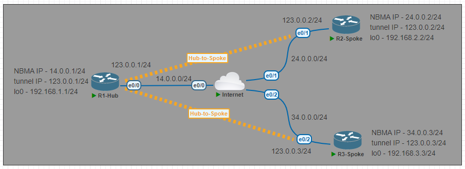

# DMVPN Phase 2 Lab

---
#### Lab for
- DMVPN
- EIGRP

#### Tasks
1. [Initial Config](#1-initial-config)
2. [Create Tunnel interface in Hub and Spoke Routers](#2-create-tunnel-interface-in-hub-and-spoke-routers)
3. [Configure Routing Protocols (EIGRP)](#3-configure-routing-protocols-eigrp)
4. [Commands](#4-verification) <br>
	`# show dmvpn` <br>
	`# show ip nhrp` <br>
	`# clear ip nhrp` <br>
	`# clear dmvpn session`
---
#### 1. Initial Config

<table>
    <tr>
<td>R1-Hub</td>
<td>R2-Spoke</td>
<td>R3-Spoke</td>
    </tr>
    <tr>
<td>

```py
host R1-Hub

int e0/0
ip add 14.0.0.1 255.255.255.0
no shut
int lo0
ip add 192.168.1.1 255.255.255.0

ip route 0.0.0.0 0.0.0.0 14.0.0.4
```

</td>
<td>

```py
host R2-Spoke1

int e0/1
ip add 24.0.0.2 255.255.255.0
no shut
int lo0
ip add 192.168.2.2 255.255.255.0

ip route 0.0.0.0 0.0.0.0 24.0.0.4
```

</td>
<td>

```py
host R3-Spoke2

int e0/2
ip add 34.0.0.3 255.255.255.0
no shut
int lo0
ip add 192.168.3.3 255.255.255.0

ip route 0.0.0.0 0.0.0.0 34.0.0.4
```

</td>
    </tr>
</table>

#### 2. Create Tunnel interface in Hub and Spoke Routers

<table>
    <tr>
<td>R1-Hub</td>
<td>R2-Spoke</td>
<td>R3-Spoke</td>
    </tr>
    <tr>
<td>

```py
interface Tunnel0
 ip address 123.0.0.1 255.255.255.0
 no ip redirects
 ip nhrp network-id 1
 ip nhrp map multicast dynamic
 tunnel source e0/0
 tunnel mode gre multipoint
```

</td>
<td>

```py
interface Tunnel0
 ip address 123.0.0.2 255.255.255.0
 ip nhrp map 123.0.0.1 14.0.0.1
 ip nhrp map multicast 14.0.0.1
 ip nhrp network-id 1
 ip nhrp nhs 123.0.0.1
 tunnel source e0/1
 tunnel mode gre multipoint
```

</td>
<td>

```py
interface Tunnel0
 ip address 123.0.0.3 255.255.255.0
 ip nhrp map 123.0.0.1 14.0.0.1
 ip nhrp map multicast 14.0.0.1
 ip nhrp network-id 1
 ip nhrp nhs 123.0.0.1
 tunnel source e0/2
 tunnel mode gre multipoint
```

</td>
    </tr>
</table>

#### 3. Configure Routing Protocols (EIGRP)

<table>
    <tr>
<td>R1-Hub</td>
<td>R2-Spoke</td>
<td>R3-Spoke</td>
    </tr>
    <tr>
<td>

```py
int tun 0
 no ip split-horizon eigrp 1
 no ip next-hop-self eigrp 1
 
router eigrp 1
 network 123.0.0.0 0.0.0.255
 network 192.168.1.0 0.0.0.255
 no auto
```

</td>
<td>

```py
router eigrp 1
 network 123.0.0.0 0.0.0.255
 network 192.168.2.0 0.0.0.255
 no auto
```

</td>
<td>

```py
router eigrp 1
 network 123.0.0.0 0.0.0.255
 network 192.168.3.0 0.0.0.255
 no auto
```

</td>
    </tr>
</table>

#### 4. Verification

```sh
R1-Hub#sh dmvpn
Interface: Tunnel0, IPv4 NHRP Details 
Type:Hub, NHRP Peers:2, 

 # Ent  Peer NBMA Addr Peer Tunnel Add State  UpDn Tm Attrb
 ----- --------------- --------------- ----- -------- -----
     1 24.0.0.2              123.0.0.2    UP 00:02:48     D
     1 34.0.0.3              123.0.0.3    UP 00:00:54     D

```
```sh
R1-Hub#sh ip nhrp 
'123.0.0.2/32' via 123.0.0.2
   Tunnel0 created 00:04:19, expire 01:55:40
   Type: 'dynamic', Flags: unique registered used nhop 
   NBMA address: '24.0.0.2' 
'123.0.0.3/32' via 123.0.0.3
   Tunnel0 created 00:02:24, expire 01:57:35
   Type: 'dynamic', Flags: unique registered used nhop 
   NBMA address: '34.0.0.3' 
```
```sh
R2-Spoke1#sh dmvpn        
Interface: Tunnel0, IPv4 NHRP Details 
Type:Spoke, NHRP Peers:2, 

 # Ent  Peer NBMA Addr Peer Tunnel Add State  UpDn Tm Attrb
 ----- --------------- --------------- ----- -------- -----
     1 14.0.0.1              123.0.0.1    UP 00:05:22     S
     1 34.0.0.3              123.0.0.3    UP 00:00:02     D
```
```sh
R2-Spoke1#sh ip nhrp
'123.0.0.1/32' via 123.0.0.1
   Tunnel0 created 00:06:18, never expire 
   Type: 'static', Flags: used 
   NBMA address: '14.0.0.1' 
'123.0.0.3/32' via 123.0.0.3
   Tunnel0 created 00:00:41, expire 01:59:18
   Type: 'dynamic', Flags: router nhop 
   NBMA address: '34.0.0.3' 
```
