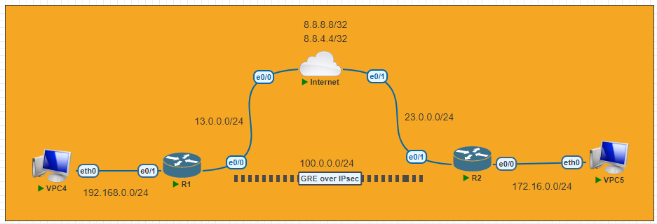

# GRE over IPsec

---
#### Lab for
- GRE over IPsec

#### Tasks
1. [Initial Config](#1-initial-config)
2. [IPsec Phrase 1 Config](#2-ipsec-phrase-1-config)
3. [IPsec Phrase 2 Config](#3-ipsec-phrase-2-config)
4. [GRE config](#4-gre-config)
5. [Configure Routing Protocol](#5-configure-routing-protocol)
6. Commands <br>
    `# clear crypto session remote [remote-IP]` <br>
    `# show crypto session` <br>
    `# show crypto ipsec transform-set` <br>
    `# show crypto isakmp sa` <br>
    `# show crypto ipsec sa`
---
#### 1. Initial Config
|R1|R2|
|:---|:---|
| `host R1`<br>`int e0/0`<br>`ip add 13.0.0.1 255.255.255.0`<br>`no shut`<br>`int e0/1`<br>`ip add 192.168.0.1 255.255.255.0`<br>`no shut`<br>`ip route 0.0.0.0 0.0.0.0 13.0.0.3`<br> | `host R2`<br>`int e0/1`<br>`ip add 23.0.0.2 255.255.255.0`<br>`no shut`<br>`int e0/0`<br>`ip add 172.16.0.2 255.255.255.0`<br>`no shut`<br>`ip route 0.0.0.0 0.0.0.0 23.0.0.3`<br> |

#### 2. IPsec Phrase 1 Config
| R1 | R2 |
|:---|:---|
| `crypto isakmp policy 10`<br> &nbsp;`encr aes 256`<br> &nbsp;`hash sha512`<br> &nbsp;`authentication pre-share`<br> &nbsp;`group 2`<br><br>`crypto isakmp key OneTwo34 address 23.0.0.2 `<br> | `crypto isakmp policy 10`<br> &nbsp;`encr aes 256`<br> &nbsp;`hash sha512`<br> &nbsp;`authentication pre-share`<br> &nbsp;`group 2`<br><br>`crypto isakmp key OneTwo34 address 13.0.0.1 `<br> |

#### 3. IPsec Phrase 2 Config
| R1 | R2 |
|:---|:---|
| `crypto ipsec transform-set MySet esp-aes 256 esp-sha512-hmac `<br> &nbsp;&nbsp;`mode transport`<br><br>`ip access-list extended MyACL`<br> &nbsp;&nbsp;`permit gre host 13.0.0.1 host 23.0.0.2`<br><br> `crypto map MyMap 10 ipsec-isakmp `<br> &nbsp;&nbsp;`set peer 23.0.0.2`<br> &nbsp;&nbsp;`set transform-set MySet `<br> &nbsp;&nbsp;`match address MyACL`<br><br> `int e0/0  `<br> &nbsp;&nbsp;`crypto map MyMap`<br> | `crypto ipsec transform-set MySet esp-aes 256 esp-sha512-hmac `<br> &nbsp;&nbsp;`mode transport`<br><br>`ip access-list extended MyACL`<br> &nbsp;&nbsp;`permit gre host 23.0.0.2 host 13.0.0.1`<br><br> `crypto map MyMap 10 ipsec-isakmp `<br> &nbsp;&nbsp;`set peer 13.0.0.1`<br> &nbsp;&nbsp;`set transform-set MySet `<br> &nbsp;&nbsp;`match address MyACL`<br><br> `int e0/0  `<br> &nbsp;&nbsp;`crypto map MyMap`<br> |

#### 4. GRE config
```py
R1#
    interface Tunnel12
     ip address 100.0.0.1 255.255.255.0
     tunnel source 13.0.0.1
     tunnel destination 23.0.0.2
```
#### 5. Configure Routing Protocol
```py
R1#
    router ospf 1
     network 100.0.0.0 0.0.0.255 area 0
     network 192.168.0.0 0.0.0.255 area 0
```


#### Testing
|C1|C2|
|---|---|
|`host R1`<br>`int e0/0`<br>`ip add 13.0.0.1 255.255.255.0`<br>`no shut`<br>`int e0/1`<br>`ip add 192.168.0.1 255.255.255.0`<br>`no shut`<br>`ip route 0.0.0.0 0.0.0.0 13.0.0.3`<br>|`host R2`<br>`int e0/1`<br>`ip add 23.0.0.2 255.255.255.0`<br>`no shut`<br>`int e0/0`<br>`ip add 172.16.0.2 255.255.255.0`<br>`no shut`<br>`ip route 0.0.0.0 0.0.0.0 23.0.0.3`<br>|
|R2|```R2#<br>router ospf 1<br>network 100.0.0.0 0.0.0.255 area 0<br>network 192.168.0.0 0.0.0.255 area 0```|
|```|```|

|R1|R2|
|---|---|
| `host R1`<br>`int e0/0`<br>`ip add 13.0.0.1 255.255.255.0`<br>`no shut`<br>`int e0/1`<br>`ip add 192.168.0.1 255.255.255.0`<br>`no shut`<br>`ip route 0.0.0.0 0.0.0.0 13.0.0.3`<br> | `host R2`<br>`int e0/1`<br>`ip add 23.0.0.2 255.255.255.0`<br>`no shut`<br>`int e0/0`<br>`ip add 172.16.0.2 255.255.255.0`<br>`no shut`<br>`ip route 0.0.0.0 0.0.0.0 23.0.0.3`<br> |
