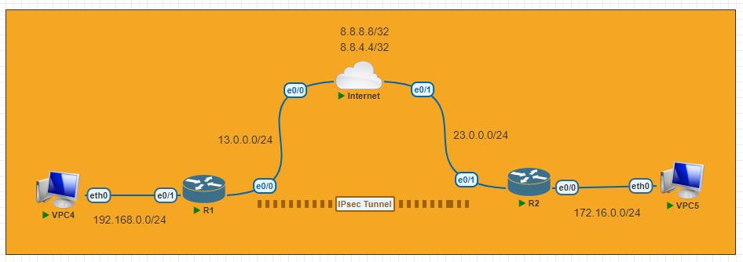

# IPsec

---
Lab for
- IPsec VPN

Task
1. Initial Config
2. IPsec Phrase 1 Config
3. IPsec Phrase 2 Config
4. Create NAT rule to access Internet from subnetA and subnetB
5. Commands <br>
	`# clear crypto session remote [remote-IP]`<br>
	`# show crypto ipsec transform-set`<br>
	`# show crypto isakmp sa`<br>
	`# show crypto ipsec sa`
---
#### 1. Initial Config
```py
R1#
	host R1
	
	int e0/0
	ip add 13.0.0.1 255.255.255.0
	no shut
	int e0/1
	ip add 192.168.0.1 255.255.255.0
	no shut
	
	ip route 0.0.0.0 0.0.0.0 13.0.0.3
```
```py
R2#
	host R2
	
	int e0/1
	ip add 23.0.0.2 255.255.255.0
	no shut
	int e0/0
	ip add 172.16.0.2 255.255.255.0
	no shut
	
	ip route 0.0.0.0 0.0.0.0 23.0.0.3
```
#### 2. IPsec Phrase 1 Config
```py
R1#
	crypto isakmp policy 10
	 encr aes 256
	 hash sha512
	 authentication pre-share
	 group 2
	 
	crypto isakmp key OneTwo34 address 23.0.0.2
```
```py
R2#
	crypto isakmp policy 10
	 encr aes 256
	 hash sha512
	 authentication pre-share
	 group 2
	 
	crypto isakmp key OneTwo34 address 13.0.0.1  
```
#### 3. IPsec Phrase 2 Config
```py
R1#
	crypto ipsec transform-set MySet esp-aes 256 esp-sha512-hmac 
	 mode tunnel
	
	ip access-list extended MyACL
	 permit ip 192.168.0.0 0.0.0.255 172.16.0.0 0.0.0.255
	 
	crypto map MyMap 10 ipsec-isakmp 
	 set peer 23.0.0.2
	 set transform-set MySet 
	 match address MyACL
	 
	int e0/0  
	 crypto map MyMap
```
```py
R2#
	crypto ipsec transform-set MySet esp-aes 256 esp-sha512-hmac 
	 mode tunnel
	
	ip access-list extended MyACL
	 permit ip 172.16.0.0 0.0.0.255 192.168.0.0 0.0.0.255
	 
	crypto map MyMap 10 ipsec-isakmp 
	 set peer 13.0.0.1
	 set transform-set MySet 
	 match address MyACL
	 
	int e0/1 
	 crypto map MyMap
```
#### 4. Create NAT rule to access Internet from subnetA and subnetB
```py
R1#
	ip access-list extended NAT-ACL
	 deny   ip 192.168.0.0 0.0.0.255 172.16.0.0 0.0.0.255 log
	 permit ip 192.168.0.0 0.0.0.255 any
	
	ip nat inside source list NAT-ACL interface Ethernet0/0 overload
	
	int e0/0
	 ip nat out
	int e0/1
	 ip nat in
```
```py
R2#
	ip access-list extended NAT-ACL
	 deny   ip 172.16.0.0 0.0.0.255 192.168.0.0 0.0.0.255 log
	 permit ip 172.16.0.0 0.0.0.255 any
	
	ip nat inside source list NAT-ACL interface Ethernet0/1 overload
	
	int e0/0
	 ip nat in
	int e0/1
	 ip nat out
```
5. Verification
```py
R2#show crypto ipsec transform-set 
	Transform set default: { esp-aes esp-sha-hmac  } 
	   will negotiate = { Transport,  }, 
	   
	Transform set MySet: { esp-256-aes esp-sha512-hmac  } 
	   will negotiate = { Tunnel,  },
```
```py
R2#sh crypto isakmp sa
	IPv4 Crypto ISAKMP SA
	dst             src             state          conn-id status
	13.0.0.1        23.0.0.2        QM_IDLE           1001 ACTIVE
```