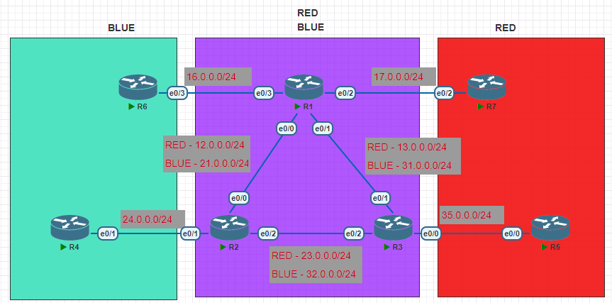

# VRF-Lite

---
Lab for
- VRF-Lite

Tasks
1. [Initial Config](#1-initial-config)
2. [Create VRF on R1, R2, R3](#2-create-vrf-on-r1-r2-r3)
3. [Assign IP address in R1, R2, R3](#3-assign-ip-address-in-r1-r2-r3)
4. [Configure OSPF in all routers.](#4-configure-ospf-in-all-routers)
5. [Verification](#5-verification)
6. Commands <br>
    `# show ip vrf` <br>
    `# show ip route vrf RED` <br>
    `# show ip route vrf BLUE`
---
#### 1. Initial Config
```py
R1#
    host R1
```
```py
R4#
    host R4
    
    int e0/1
    ip add 24.0.0.4 255.255.255.0
    no shut
```
#### 2. Create VRF on R1, R2, R3
```py
R1#
    ip vrf RED
    ip vrf BLUE
```
#### 3. Assign IP address in R1, R2, R3
```py
R1#
    interface Ethernet0/0.1
     encapsulation dot1Q 10
     ip vrf forwarding RED
     ip address 12.0.0.1 255.255.255.0
    interface Ethernet0/0.2
     encapsulation dot1Q 20
     ip vrf forwarding BLUE
     ip address 21.0.0.1 255.255.255.0
    
    interface Ethernet0/1.1
     encapsulation dot1Q 10
     ip vrf forwarding RED
     ip address 13.0.0.1 255.255.255.0
    interface Ethernet0/1.2
     encapsulation dot1Q 20
     ip vrf forwarding BLUE
     ip address 31.0.0.1 255.255.255.0
     
    interface Ethernet0/2
     ip vrf forwarding RED
     ip address 17.0.0.1 255.255.255.0
     no shut
     
    interface Ethernet0/3
     ip vrf forwarding BLUE
     ip address 16.0.0.1 255.255.255.0
     no shut
     
    interface Ethernet0/0
     no shut
    interface Ethernet0/1
     no shut
```
#### 4. Configure OSPF in all routers.
```py
R1#
    router ospf 1 vrf RED
     router-id 0.0.1.1
     network 12.0.0.0 0.0.0.255 area 0
     network 13.0.0.0 0.0.0.255 area 0
     network 17.0.0.0 0.0.0.255 area 0
    router ospf 2 vrf BLUE
     router-id 0.0.2.1
     network 16.0.0.0 0.0.0.255 area 0
     network 21.0.0.0 0.0.0.255 area 0
     network 31.0.0.0 0.0.0.255 area 0
```
#### 5. Verification
```py
R1#sh ip route vrf RED 
      12.0.0.0/8 is variably subnetted, 2 subnets, 2 masks
C        12.0.0.0/24 is directly connected, Ethernet0/0.1
L        12.0.0.1/32 is directly connected, Ethernet0/0.1
      13.0.0.0/8 is variably subnetted, 2 subnets, 2 masks
C        13.0.0.0/24 is directly connected, Ethernet0/1.1
L        13.0.0.1/32 is directly connected, Ethernet0/1.1
      17.0.0.0/8 is variably subnetted, 2 subnets, 2 masks
C        17.0.0.0/24 is directly connected, Ethernet0/2
L        17.0.0.1/32 is directly connected, Ethernet0/2
      23.0.0.0/24 is subnetted, 1 subnets
O        23.0.0.0 [110/20] via 13.0.0.3, 00:04:06, Ethernet0/1.1
                  [110/20] via 12.0.0.2, 00:07:12, Ethernet0/0.1
      35.0.0.0/24 is subnetted, 1 subnets
O        35.0.0.0 [110/20] via 13.0.0.3, 00:04:06, Ethernet0/1.1
```
```py
R1#ping vrf RED 35.0.0.5
Type escape sequence to abort.
Sending 5, 100-byte ICMP Echos to 35.0.0.5, timeout is 2 seconds:
!!!!!
Success rate is 100 percent (5/5), round-trip min/avg/max = 1/1/2 ms
```
```py
R1#ping vrf BLUE 24.0.0.4
Type escape sequence to abort.
Sending 5, 100-byte ICMP Echos to 24.0.0.4, timeout is 2 seconds:
!!!!!
Success rate is 100 percent (5/5), round-trip min/avg/max = 1/1/3 ms
```
```py
R2#sh ip vrf
  Name                             Default RD            Interfaces
  BLUE                             <not set>             Et0/0.2
                                                         Et0/2.2
                                                         Et0/1
  RED                              <not set>             Et0/0.1
                                                         Et0/2.1
```